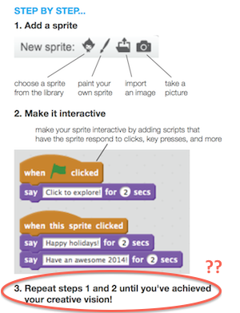
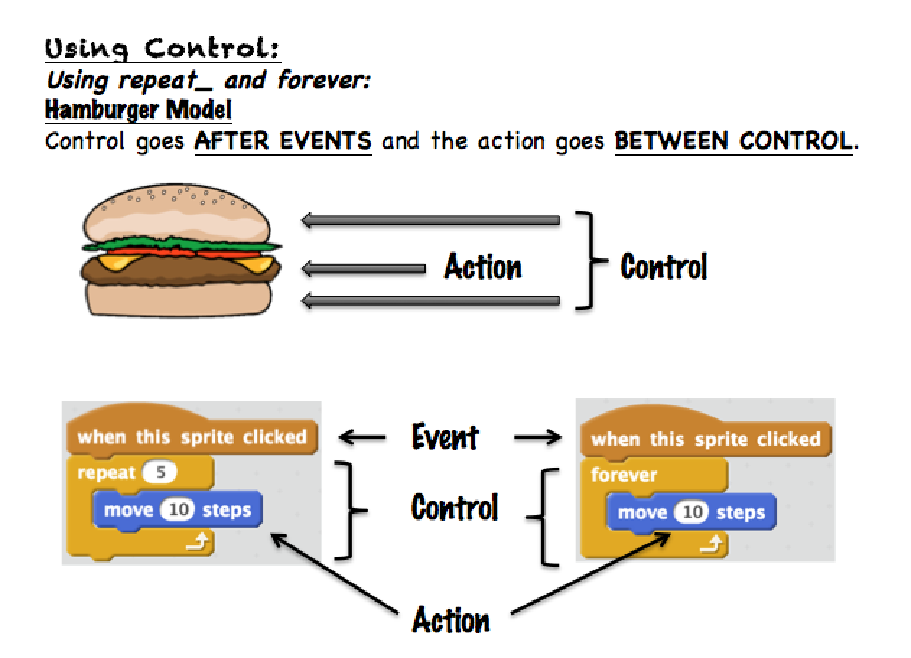
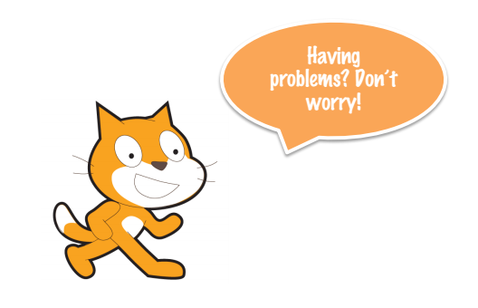
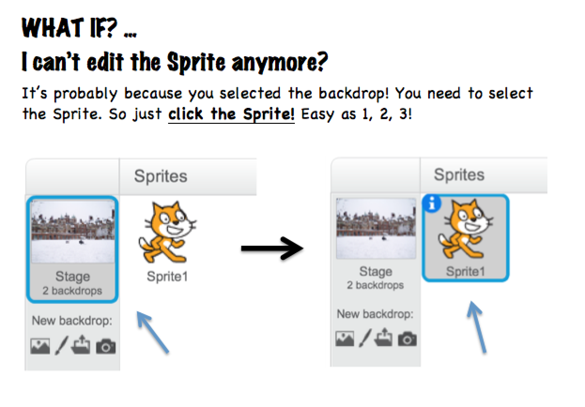

#Hour of Code Philadelphia

##Teaching the basics of Scratch in 60 minutes

At Penn GSE, we're heavily involved with Scratch and so being tasked to help out with teaching it as part of Hour of Code was a natural thing.

It seemed pretty straight forward and easy. I've been helping teach 8 week long workshops in Scratch, seasoned pro right?

Well, there were a couple things to worry about:

1. Exactly the fact that I've been teaching 8 week workshops. 8 weeks. EIGHT weeks to teach Scratch.

2. How do you cram anything within an hour? What can they even learn within that time frame?

3. This is the first time most of the kids I teach get any exposure to coding. How do you make it super fun? What if you completely mess up this experience for them and they never want to code again?!

##Approach
The folks at Scratch are awesome in creating a custom tutorial/exercise for Hour of Code.

They basically designed a Holiday Card Tutorial stepping through how to make all aspects of a card which you can see <a href="http://scratch.mit.edu/projects/editor/?tip_bar=hoc" target="_blank">here</a>. 

The PDF description of the project looked like this. Pretty formulaic and non-descriptive. Since the Hour of Code audience is mostly new to coding, the steps needed to be broken down way more than that.

The step by step tutorial linked above is a lot better, providing a more general coverage of what you could do for the card and where to find them. However, when you get to interactions, it's more of a dump of a bunch of things you could do without any unifying concepts. 

The things that I saw students struggle with most were not covered by these tutorials:  
1. Not knowing how to get started in Scratch  
2. Not understanding how interactions, characters and events tie together.

##Creating the Scratch Dictionary  

###**The "Where to begin?" issue**
Students without any prior exposure to programming or the Scratch environment are often at a lost as to where to begin. The Scratch interface has a lot of options, buttons and blocks - quite intimidating to a new user 

###**The "How does everything connect?" issue**
It's easy to snap together a bunch of blocks but how do you make it really do what you want? That's something I see a lot of students struggle with - they put together a bunch of seperate blocks in the wrong places. The Hour of Code tutorial never quite explained the seperate roles of characters, interactions and events, but jumbled a little bit of each. 

###**Outcome**
The guide would have to be catered toward the holiday card activity, but provide a greater introduction to the basics of Scratch. 

A main issue I saw is that the tutorial focused mostly on actions and as a side note added events and controls. Yet, in order for you to really see the effects of the actions, you need events and controls. Those two are also the most complex as they carry over more programming logic.

So I first made an introduction to events and controls describing what they do, but more importantly how they interact with actions. 

An example:

The placement of different blocks tends to trip many students up, and so I devised an analogy - because it's easier to learn something if it's similar to what you already know and who could resist that burger illustration?

Another big issue for me when preparing this workshop was that we had a limited amount of time with a limited number of teachers at each workshop, but a full classroom of students. There will definitely be lots of questions and confusion, and a lot of time being stuck since we would have to make our way around the room. 

There were some recurring questions I encountered when teaching the longer workshops and decided to include a troubleshooting section in the guide catering to these issues. That way, little things like these won't get in the way of creating the card.

You can see the dictionary in full <a href="https://drive.google.com/open?id=0B5K45YZyF-A6U0FLeVN1UmV0dm8&authuser=0" target="_blank">here</a>

##Reflections & Things Learned 
The workshop reaffirmed a couple of things that I've been really interested in seeing more of in the way that education is structured:

1. Interesting projects increase engagement and give students a willingness to dedicate time and effort.    
* Christmas-songs-on-the-radio season was in full swing and the topic of the tutorial was relevant and applicable. 
* Students were really into customizing their card for someone in their life    

2. Creativity is key. Students were able to do almost whatever they wanted when designing the card. It makes the process a lot more enjoyable. 
* There were also students who chose not to do the card but work on something else. It was really interesting to see, as they worked diligently on their idea and were genuinely interested in pursuing a different route. Who was I to stop them?

Read a little more about our involvement <a href="http://www.thedp.com/article/2013/12/gse-education-week" target="_blank">here</a>.
