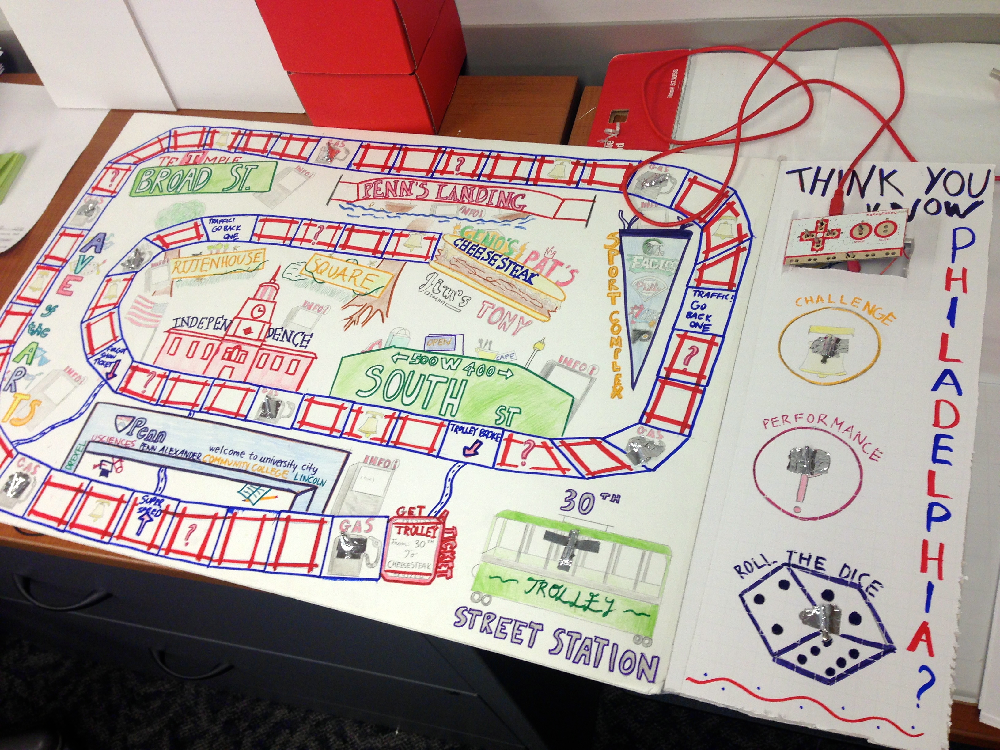
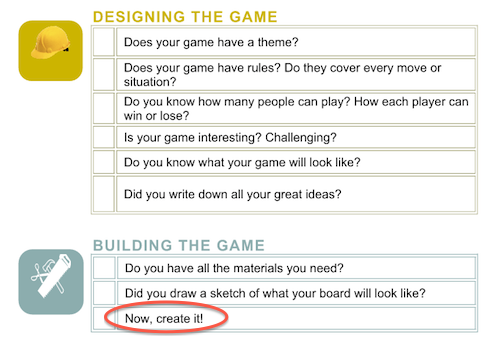
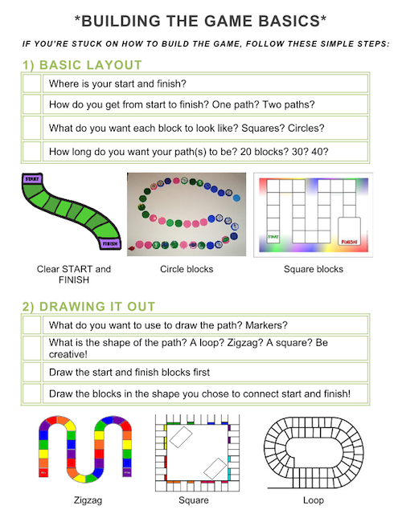

#Penn Alexander Digital Board Games Workshop F'13

##General
We worked with 5th to 7th graders at Penn Alexander Public School, conducting bi-weekly workshops that allowed students to create their own board games and incorporate Scratch programming and MaKey MaKey basics. 

##Role
Since the workshop times conflicted with my class schedule, I was never able to attend the workshops themselves. Instead I worked behind the scenes before the workshop to plan the lesson and also after to analyze the video content produced.

It was a really interesting combination as I got to see how much really goes into running a workshop and how it's much more than just the workshop itself. Definitely got to approach it from more of an analytical perspective.

##Highlights

###*Creating a Board Game*
To demonstrate the process of making a board game and how to incorporate digital components, we made a demo board for the workshop. 

We first started with a simple Philadelphia board game with a couple of blocks and only a digital dice. 

We then iterated and produced a final large scale version with illustrations, added complexity and also digital card components. 

By far one of the funnest things ever. Whole time I couldn't stop repeating "I love my job", I mean how long has it been since this was something I got to do in school?

###*Learning to Teach*
This was one of my first opportunities to be really involved in planning a lesson and making resources like worksheets and guides that students would be using. 

One major thing I've learned is that it's quite easy to misjudge how much a student knows and taking for granted that when producing resources. 

I first made the following resource to help break down the huge process of building a board game.

I assumed that if you have all these ideas and materials, you would naturally be able to create a sketch and start creating. What I quickly found out after hearing what happened during the workshop was that it's a lot easier to come up all these ideas than to implement. Designing a whole board is no easy task and there's a lot to think about.

So, I created another resource to help get students started in actually drawing out the board. I first broke down the design process to several steps, and things to think about within each step. I also included examples since it's much easier to create something similar to what you already know and some students might be more visual learners. 

Here's a snippet of the change:

The feedback was amazing. Veena told me that the students started working on this sheet and had that "Ohhhh" moment as they were able to put their ideas in different pieces and bring their board to life. Awesome, awesome feeling.